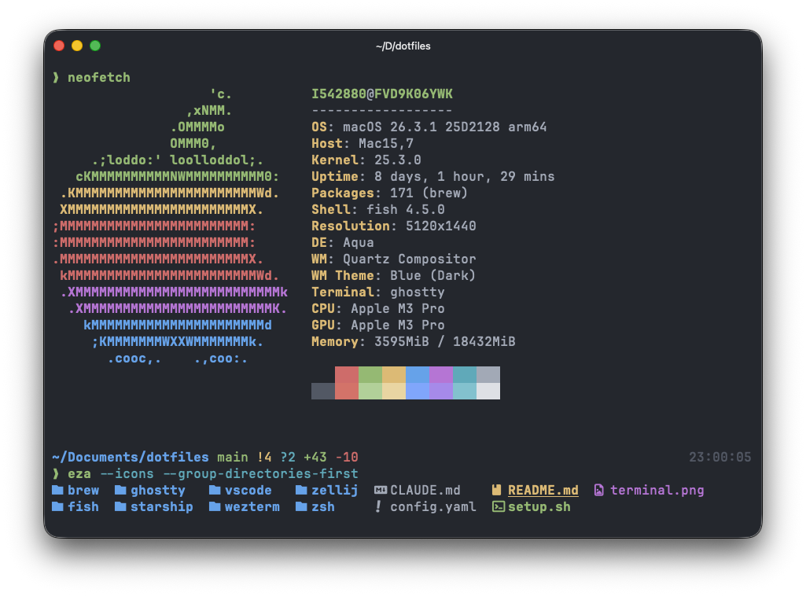

# dotfiles

Personal dotfiles managed with [GNU Stow](https://www.gnu.org/software/stow/).

## Stack

| Tool | Purpose |
| --- | --- |
| [Fish](https://fishshell.com/) | Shell |
| [Ghostty](https://ghostty.org/) | Terminal emulator |
| [Homebrew](https://brew.sh/) | Package manager |
| [Starship](https://starship.rs/) | Prompt |
| [Yazi](https://yazi-rs.github.io/) | File manager |
| [Zellij](https://zellij.dev/) | Terminal multiplexer |

### macOS Apps

| App | Purpose |
| --- | --- |
| [AltTab](https://alt-tab-macos.netlify.app/) | Windows-style alt-tab |
| [BetterTouchTool](https://folivora.ai/) | Keyboard/trackpad customization |
| [Karabiner-Elements](https://karabiner-elements.pqrs.org/) | Key remapping |

## Color Palette

Based on
Ghostty theme: [**Atom One Dark**](https://iterm2colorschemes.com/)
and
VS Code theme: [**One Dark Pro**](https://github.com/Binaryify/OneDark-Pro)
with [personal modifications](ghostty/.config/ghostty/config.ghostty#L4-L14)



| Color | Hex | Preview |
| --- | --- | --- |
| Black | `#282c34` |  |
| Red | `#e06c75` |  |
| Green | `#98c379` |  |
| Yellow | `#e5c07b` |  |
| Blue | `#61afef` |  |
| Magenta | `#c678dd` |  |
| Cyan | `#56b6c2` |  |
| White | `#abb2bf` |  |
| Bright Black | `#5c6370` |  |
| Bright Red | `#e57373` |  |
| Bright Green | `#b5d8a0` |  |
| Bright Yellow | `#efd9a8` |  |
| Bright Blue | `#82b1ff` |  |
| Bright Magenta | `#b392f0` |  |
| Bright Cyan | `#80ccd5` |  |
| Bright White | `#e1e4e8` |  |
| Foreground | `#abb2bf` |  |
| Background | `#282c34` |  |
| Selection | `#3e4451` |  |

## Install

```bash
git clone https://github.com/LazyRen/dotfiles.git
cd dotfiles
# Edit config.yaml to enable/disable apps before running
./setup.sh
```

`config.yaml` controls which apps are installed. Comment out any
app to skip it.

`setup.sh` will:

1. Install Homebrew packages from `brew/list.yaml`
2. Symlink configured apps to `$HOME` via stow
3. Run per-app `setup.sh` hooks (fisher plugins, yazi packages, zellij plugins, etc.)

Re-run after pulling config-only changes:

```bash
./setup.sh --skip-brew
```

## Structure

```text
config.yaml          # Apps to install (comment out to disable)
brew/list.yaml       # Homebrew formulas, casks, and link targets
setup.sh             # Main installer

# Stow packages (symlinked to $HOME)
fish/                # Fish shell config, functions, fisher plugins
ghostty/             # Ghostty terminal config
karabiner/           # Karabiner-Elements key remapping
starship/            # Starship prompt config
yazi/                # Yazi file manager config and plugins
zellij/              # Zellij multiplexer config, layouts, plugins

# macOS-specific (hook-only, not stowed)
os/mac/              # macOS defaults, xcode-select, app imports

# App config imports (not stowed, referenced by os/mac/setup.sh)
alttab/              # AltTab preferences plist
bettertouchtool/     # BetterTouchTool preset
```

Each directory mirrors `$HOME` for stow (e.g., `fish/.config/fish/` → `~/.config/fish/`).
Nested paths like `os/mac` are hook-only — they run `setup.sh` but are not stowed.

## Adding a new app

1. Create `<app>/.config/<app>/` with your config files
2. Add `- <app>` to `config.yaml`
3. Run `./setup.sh`

If the app needs post-stow setup, add an executable `setup.sh` in the app directory and create a `.stow-local-ignore` file (see `fish/.stow-local-ignore` for reference).

## macOS Setup

`os/mac/setup.sh` configures macOS system preferences via `defaults write`, including:

- Appearance, Dock, Mission Control, Finder
- Keyboard repeat, function keys, shortcuts (desktop switching, input sources, Spotlight)
- Trackpad gestures, accessibility (drag lock)
- Screenshots location, window management
- Imports BetterTouchTool preset and AltTab preferences

## SSH Terminfo

Ghostty uses `xterm-ghostty` as its `TERM` value, in case remote hosts won't recognize by default.
Copy the terminfo entry before connecting:

```bash
infocmp -x | ssh <user@address> -- tic -x -
```

See [Ghostty SSH documentation](https://ghostty.org/docs/help/terminfo#ssh) for details.

## Local config

Fish supports per-machine overrides via `~/.config/fish/conf.d/local.fish`.
This file is gitignored and created automatically by `fish/setup.sh` on fresh clones.
Edit it freely — changes stay local and won't appear in `git status`.
